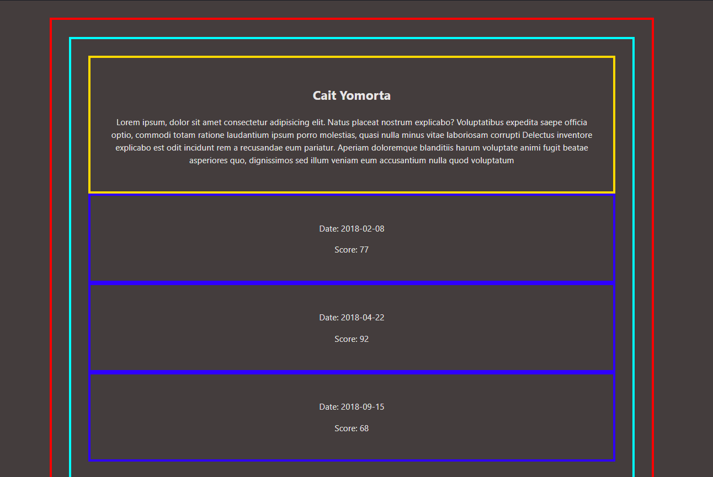

# ALAB 320H.3.1 - Rendering Arrays from State

## Overview

This lab will test your ability to create components from arrays stored in state.

## Instructions

This lab will test your ability to create components from arrays stored in state.

1. Create a `React` CodeSandbox and name it "Rendering Arrays in React."
2. Follow the requirements below to create your React application.
3. Submit the link to your CodeSandbox on Canvas when you are finished.

The following requirements must be met for this lab to be considered successful:

1. The layout and styling of the site is left up to your discretion. There are no layout or styling requirements, but you should always make sure your web applications are neat, sensible, and provide a good user experience.

2. Use the provided array of "learner" data below to initialize state as an object with a learners key in the `<App>` component.

3. Code the <App> component to display a `<Learner>` component for each learner object in the learners array being held in state.

4. Code the <Learner> component so that it:

    1. Renders the learners's name & bio properties.
    2. Renders a <Score> component for each score object in the learner's scores property.
5. Code the <Score> component so that it renders the score object's date & score properties.

## Provided Learner Array

```
[
  {
    name: 'Cait Yomorta',
    bio: 'Lorem ipsum, dolor sit amet consectetur adipisicing elit. Natus placeat nostrum explicabo? Voluptatibus expedita saepe officia optio, commodi totam ratione laudantium ipsum porro molestias, quasi nulla minus vitae laboriosam corrupti Delectus inventore explicabo est odit incidunt rem a recusandae eum pariatur. Aperiam doloremque blanditiis harum voluptate animi fugit beatae asperiores quo, dignissimos sed illum veniam eum accusantium nulla quod voluptatum',
    scores: [
      {
        date: '2018-02-08',
        score: 77
      },
      {
        date: '2018-04-22',
        score: 92
      },
      {
        date: '2018-09-15',
        score: 68
      }
    ]
  },
 // ....

]

```
## Screenshots


## Getting Started
- Download dependencies:

```
npm install
```
- Run the app:

```
npm run start
```