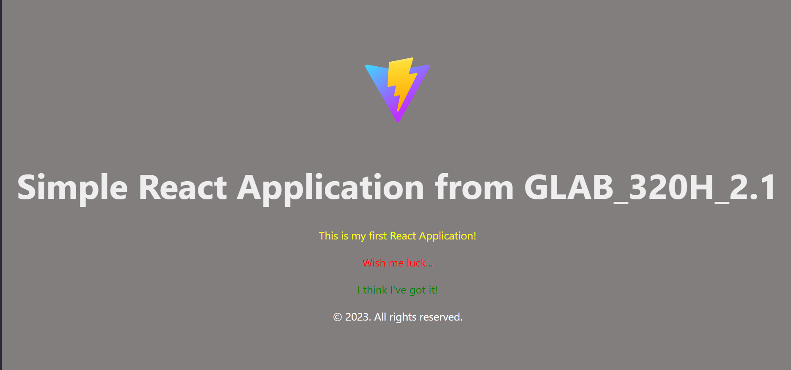

# Simple React Application

## Overview
This React App is a Guided Lab from GLAB 320H.2.1 from Per Scholas Training Program.


## Screenshots

#### Home Page



## Getting Started
- Download dependencies:

```
npm install
```
- Run the app:

```
npm run start
```