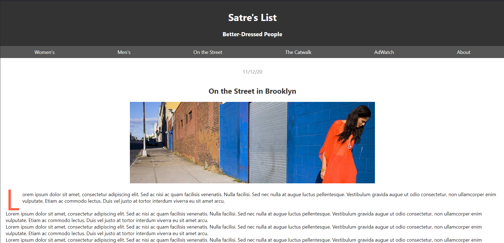
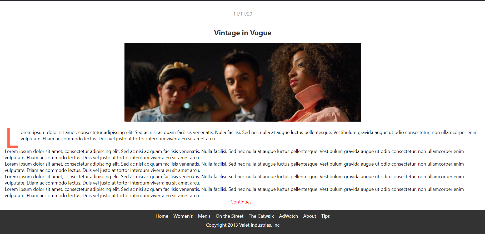

# React Fashion Blog

## Overview
This project is a practice to recreate an HTML page into a React Application.

## Screenshots



## Getting Started
- Download dependencies:

```
npm install
```
- Run the app:

```
npm run start
```