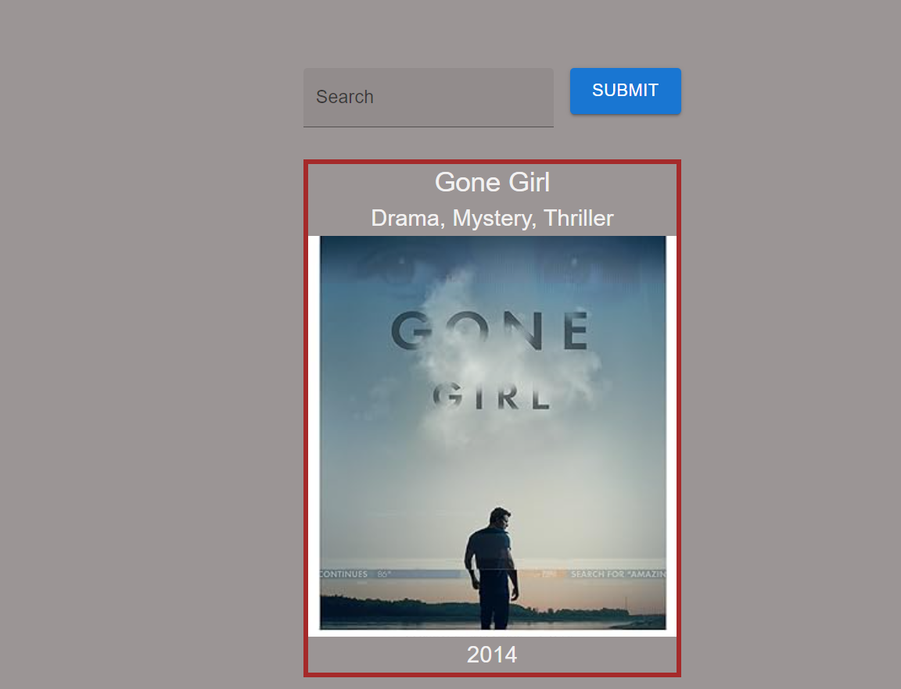

# React Movie Search App

## Overview
Created a React Application using Vite to fetch Movie data from http://www.omdbapi.com/ and display such data.

`useEffect` hook, was used for lifting state that is shared by components, and to ensure a random movie data was displayed on component render.

## Screenshot


## Getting Started
- Download dependencies:

```
npm install
```
- Run the app:

```
npm run start
```

